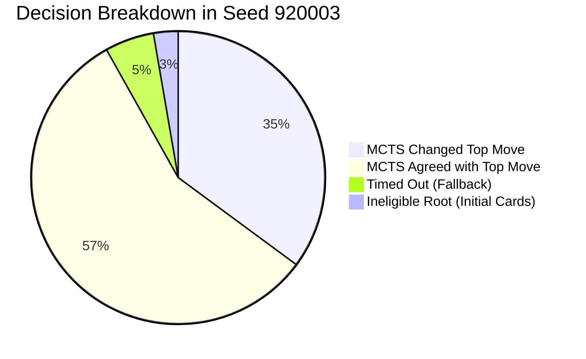
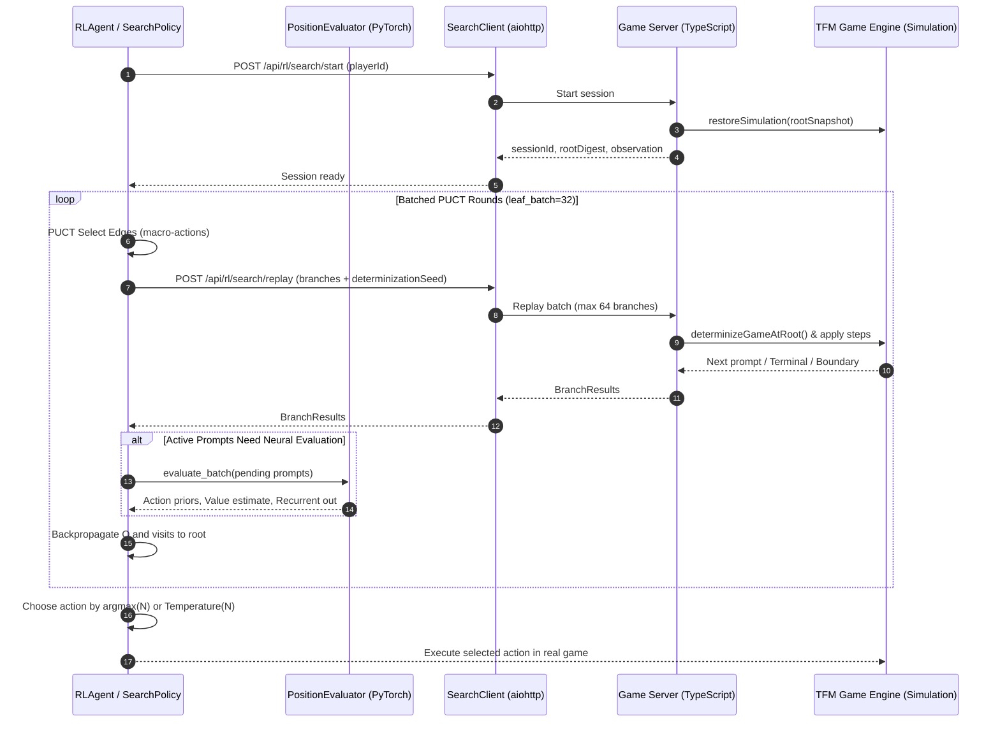

# Terraforming Mars MCTS Analysis & Agent Improvement Plan

## Executive Summary

This document presents a comprehensive diagnostic and algorithmic analysis of Monte Carlo Tree Search (MCTS) for the 4-player imperfect-information game **Terraforming Mars (TFM)**, based on:
1. The empirical telemetry trace [`mcts_trace_seed920003_seat0.txt`](file:///c:/Users/henox/source/repos/TFM/rl-alphago/metrics/mcts_trace_seed920003_seat0.txt) and its raw JSON representation [`mcts_trace_seed920003_seat0.json`](file:///c:/Users/henox/source/repos/TFM/rl-alphago/metrics/mcts_trace_seed920003_seat0.json);
2. The search subsystem in [`rl-environment/search/`](file:///c:/Users/henox/source/repos/TFM/rl-environment/search);
3. The TypeScript server-side simulation engine in [`terraforming-mars/src/server/training/SearchSimulationService.ts`](file:///c:/Users/henox/source/repos/TFM/terraforming-mars/src/server/training/SearchSimulationService.ts);
4. The AlphaGo training and distillation roadmap in [`README-ALPHAGO.md`](file:///c:/Users/henox/source/repos/TFM/README-ALPHAGO.md) and [`aplhago-mcts.md`](file:///c:/Users/henox/source/repos/TFM/aplhago-mcts.md).

It formulates an actionable implementation plan to transform MCTS from an evaluation-only diagnostic tool into a high-performance engine for **agent policy and value improvement**.

---

## 1. Deep Analysis of the Seed 920003 Trace

### 1.1 Trace Diagnostics & High-Level Telemetry

The trace records the behavior of Seat 0 (`red`, `pca7e477fc47e`) over 8 generations:

| Metric | Measured Value | System Diagnosis |
| :--- | :--- | :--- |
| **Recorded Decisions** | 37 | 34 searched, 1 ineligible (`initialCards`), 2 timed out (`timeout:or`) |
| **Game Completion** | `False` (Failure placeholder VP=0, rank=4) | **Killed by supervisory timeout** (`TM_GAME_TIMEOUT_SEC=300s`) |
| **Total Search Time** | 706.7 s (~11.78 minutes) | Average **19.11 s per searched decision** |
| **Replay Batch Latency** | 0.23 s | HTTP/network transport is not the bottleneck (~40 batches per decision) |
| **Simulations Selected** | 1,088 | Exactly $34 \times 32$ (ran fixed budget of 32 sims/decision) |
| **Invalid Rollouts** | 177 (**16.27%**) | **Fails the <10% health threshold** set in AlphaGo roadmap |
| **Killed Tree Edges** | 10 | Concentrated consecutive failures pruned 10 edges |
| **Policy Overrides** | **13/34 (38.2%)** direct top move changed | Search exhibits strong policy influence, not passive validation |



### 1.2 Root Cause of Game Non-Completion

The summary reports `games_completed=False` and all players receiving rank 4 with 0 VP. 

**Root Cause**: In [`tournament_manager.py:L376-384`](file:///c:/Users/henox/source/repos/TFM/rl-environment/tournament_manager.py#L376-L384), each single game is supervised with:
```python
timeout_sec = float(os.getenv('TM_GAME_TIMEOUT_SEC', '300')) # 5 minutes default
agent_results = await asyncio.wait_for(asyncio.shield(agent_group), timeout=timeout_sec)
```
Because the agent spent **19.11 seconds per search across 37 decisions**, search computation alone took **706.7 seconds (~11.8 minutes)**, triggering the 300-second supervisor timeout and aborting the game mid-generation 8.

### 1.3 Concentration of Invalid Simulations in Small Roots

Our granular analysis of all 1,088 simulations revealed a striking pattern:

```text
--- Invalid simulations by legal action count ---
Legal = 1:  2 decs, sims =  64, inv = 51 (79.7% invalid!)
Legal = 2:  6 decs, sims = 192, inv = 72 (37.5% invalid!)
Legal = 3:  2 decs, sims =  64, inv =  4 ( 6.2% invalid)
Legal = 4:  1 decs, sims =  32, inv =  0 ( 0.0% invalid)
Legal = 5:  4 decs, sims = 128, inv =  7 ( 5.5% invalid)
Legal = 7:  3 decs, sims =  96, inv = 13 (13.5% invalid)
Legal = 8:  2 decs, sims =  64, inv = 12 (18.8% invalid)
Legal = 16: 7 decs, sims = 224, inv =  7 ( 3.1% invalid)
```

> [!WARNING]
> **Roots with $\le 2$ legal actions accounted for 123 of the 177 invalid simulations (69.5%)!**
> Specifically:
> - **Decision #16** (Gen 4, 1 legal action = Pass): 25/32 invalid (78.1%)
> - **Decision #32** (Gen 7, 1 legal action = Pass): 26/32 invalid (81.2%)
> - **Decision #7, #14, #15, #31** (2 legal actions): 46.9% to 59.4% invalid each.

#### Why did passing cause invalid simulations?
In Terraforming Mars, when a player selects `Pass for this generation`, they relinquish all further turns until the next generation:
1. The game server advances to opponents. In rollouts, opponent continuations are sampled using the neural policy under determinized cards.
2. If opponents also pass, the generation closes and triggers the **Production Phase**, followed by Generation increment.
3. In [`SearchSimulationService.ts:L777-779`](file:///c:/Users/henox/source/repos/TFM/terraforming-mars/src/server/training/SearchSimulationService.ts#L777-L779), `isReplayPhaseSupported(phase)` only allows `ACTION` and `RESEARCH`. If the simulation hits production or deck recycling (`discardPileWasRecycled`), it marks the branch as `boundary`.
4. In Python [`rollout.py:L346-349`](file:///c:/Users/henox/source/repos/TFM/rl-environment/search/rollout.py#L346-L349), `boundary` is treated as `invalid`.
5. Running 32 MCTS simulations on a forced `Pass` action when no other legal move exists was pure wasted computation and directly inflated the invalid rate!

### 1.4 How MCTS Altered Policy Decisions (38.2% Divergence)

The policy network prior $P$ was overruled in 13 decisions:

```text
Dec # 2 Gen 1 or    (legal=11) [CHANGED] Sims=32 Inv=10 (31%)
      Chosen: 'Pass for this generation' (P=0.04, N= 9, Q=+0.245)
      PriorTop: 'Play project card: Vesta Shipyard' (P=0.42, N= 5, Q=-0.010)

Dec # 5 Gen 2 or    (legal= 9) [CHANGED] Sims=32 Inv= 0 ( 0%)
      Chosen: 'Play project card: Aquifer' (P=0.20, N= 8, Q=+0.255)
      PriorTop: 'Play project card: Olympus Conference' (P=0.28, N= 6, Q=+0.279)

Dec # 8 Gen 3 card  (legal=16) [CHANGED] Sims=32 Inv= 0 ( 0%)
      Chosen: 'Buy: Special Design' (P=0.06, N=22, Q=+0.190)
      PriorTop: 'Buy: Media Archives' (P=0.18, N= 3, Q=+0.228)

Dec #13 Gen 4 or    (legal= 3) [CHANGED] Sims=32 Inv= 1 ( 3%)
      Chosen: 'Play project card: Special Design' (P=0.36, N=16, Q=+0.832)
      PriorTop: 'Pass for this generation' (P=0.51, N=10, Q=+0.764)

Dec #18 Gen 5 or    (legal= 5) [CHANGED] Sims=32 Inv= 7 (22%)
      Chosen: 'Play project card: Asteroid:SP' (P=0.22, N=12, Q=+0.771)
      PriorTop: 'Play project card: Aquifer' (P=0.29, N= 1, Q=+0.707)

Dec #21 Gen 6 card  (legal=16) [CHANGED] Sims=32 Inv= 1 ( 3%)
      Chosen: 'Buy: Small Animals' (P=0.05, N=12, Q=+0.988)
      PriorTop: 'Buy: Designed Microorganisms' (P=0.30, N=10, Q=+0.755)

Dec #36 Gen 8 or    (legal= 6) [CHANGED] Sims=32 Inv= 0 ( 0%)
      Chosen: 'Play project card: Greenery' (P=0.16, N= 9, Q=+0.835)
      PriorTop: 'Play project card: City' (P=0.36, N= 8, Q=+0.701)
```

**Key Strategic Insights**:
- **Correcting Premature Big Spends**: In Decision #2, the raw policy wanted to spend all starting cash on *Vesta Shipyard* ($P=0.42$). MCTS evaluated rollouts and discovered $Q=-0.010$ (loss of tempo/resource starving), preferring to pass and preserve cash ($Q=+0.245$).
- **Recognizing High-Synergy Cards**: In Decision #21, the raw policy assigned only $P=0.05$ to *Small Animals*, preferring *Designed Microorganisms* ($P=0.30$). MCTS explored *Small Animals*, found $Q=+0.988$ (enormous VP payoff from microbes/plants accumulated), and allocated 12 visits to select it.
- **Endgame Conversion**: In Decision #36, policy favored *City* ($P=0.36$), but MCTS chose *Greenery* ($N=9, Q=+0.835$ vs $Q=+0.701$), securing immediate TR and placement VP.

This proves that **MCTS contains genuine tactical and strategic superiority over the raw policy network**, and if distilled back into the network, can significantly raise agent play strength!

---

## 2. Architecture of the Terraforming Mars MCTS System



### 2.1 Information-Set MCTS & Determinization

Terraforming Mars is an **imperfect-information game**:
- Players have private hands and private drafted cards.
- The project draw deck order is hidden.
- Future card draws and resource steals depend on hidden information.

Standard perfect-information MCTS cannot be applied directly. The implementation uses **Determinized Information-Set MCTS (IS-MCTS)**:
1. For every simulation branch, a fresh determinization seed is derived:
   $$\text{seed} = \text{base\_seed} \times 1,000,003 + \text{sim\_idx} \times 1009 + \text{edge\_pos} \times 3 + 1$$
2. In [`SearchSimulationService.ts:L787-840`](file:///c:/Users/henox/source/repos/TFM/terraforming-mars/src/server/training/SearchSimulationService.ts#L787-L840):
   - Opponents' private cards in hand + project draw pile + hidden research offers are pooled together:
     $$\text{Pool} = \text{DrawPile} \cup \bigcup_{i \ne \text{root}} \text{Hand}_i \cup \bigcup_{i \ne \text{root}} \text{ResearchOffers}_i$$
   - The pool is shuffled with a `SeededRandom` keyed by `rootDigest:determinizationSeed`.
   - Cards are redealt into opponents' hands and draw deck, preserving exact hand sizes.
   - The searching player's hand, resources, played cards, and public board remain **identical and untouched**.
3. **Information Leaks Prevented**: The server never returns serialized hidden hands or deck orders across the HTTP interface.

### 2.2 Tree Representation: Own Macro-Actions vs Opponent Rollouts

In standard chess/Go MCTS, all players' moves exist in the tree. In TFM, doing so causes severe invalidity because **a recorded opponent move under determinization $A$ is almost always illegal under determinization $B$** (they won't hold the same cards!).

Therefore, the tree design in [`node.py`](file:///c:/Users/henox/source/repos/TFM/rl-environment/search/node.py) and [`mcts.py`](file:///c:/Users/henox/source/repos/TFM/rl-environment/search/mcts.py) is asymmetric:
- **Tree Nodes**: Represent **only the searching player's top-level strategic decisions** (macro-actions).
- **Opponent Moves**: Sampled freshly on each simulation branch via their policy network and never persisted in the tree.
- **Child Matching**: Depth-2 tree descent matches child edges by canonical action payload key or action label.
- **Pruning**: An edge with consecutive failures incrementing up to `edge_kill_failures` (default 3) is marked `dead`, preventing bad paths from wasting search slots.

---

## 3. Core Bottlenecks & Limitations Identified

### 3.1 Latency Bottleneck: Replay Amplification & HTTP Rounds

In the trace, search required **19.11 seconds per decision**.
- Even though single replay batches took only $0.23\text{ s}$, a decision required up to **40 sequential rounds** of Python $\leftrightarrow$ HTTP $\leftrightarrow$ TypeScript.
- **Replay Amplification**: When an action path grew step-by-step ($1 \to 2 \to \dots \to L$), re-sending the whole path caused the server to execute $\mathcal{O}(L^2)$ transitions.
- While incremental branch caching was recently introduced on the server, Python-side batching still submits branches in small batches (`leaf_batch=32`) whenever unvisited edges need initial evaluation.

### 3.2 Inefficient State Hashing in Python Evaluator

In [`evaluator.py:L54-65`](file:///c:/Users/henox/source/repos/TFM/rl-environment/search/evaluator.py#L54-L65):
```python
def _cache_key(self, item: EvalItem) -> str:
    digest = hashlib.sha256()
    digest.update(str(item.player_id).encode("utf-8", errors="replace"))
    digest.update(str(int(item.turn_count)).encode("ascii"))
    digest.update(
        json.dumps(item.player_state, sort_keys=True, separators=(",", ":"), default=str).encode(
            "utf-8", errors="replace"
        )
    )
    ...
```
`item.player_state` is the full `PlayerViewModel` containing boards, tiles, decks, log history, and player cards (often 50–150 KB of JSON). Running `json.dumps(..., sort_keys=True)` synchronously in Python for every single evaluated prompt creates severe CPU serialization overhead and event loop pauses.

### 3.3 Strategy Fusion in Imperfect-Information MCTS

IS-MCTS averages payoffs across separate determinizations as if the player knows which determinization they are in at leaf nodes. In card games, this causes:
- **Strategy Fusion**: The search may pick a line of play that works well on average across all 8 determinizations, but requires knowledge of opponent cards that the player cannot actually know during execution.
- **Non-Locality**: Leaf evaluations depend on the network's value head. If the neural value head is poorly calibrated to endgame scoring (e.g. overvaluing raw TR while ignoring milestone/award VP or card synergy points), PUCT will reinforce biased moves.

### 3.4 Missing Strategic Roots: Drafting and Initial Cards

Currently, [`prompts.py`](file:///c:/Users/henox/source/repos/TFM/rl-environment/search/prompts.py) restricts search roots to `or,card,space` in Action/Research phases:
- Initial corporation and card selection (`initialCards`) is marked `fallback_ineligible`.
- Drafting is completely unsupported because draft hands rotate simultaneously among 4 players with non-serializable callbacks.
- In competitive Terraforming Mars, **initial hand selection and drafting constitute over 40% of win-rate variance**. Bypassing them leaves the agent vulnerable to poor opening hands.

---

## 4. The Agent Improvement Roadmap (AlphaZero Distillation)

Turning on MCTS during training games is **not** as simple as substituting actions in PPO. 

> [!CAUTION]
> **Why MCTS actions cannot be placed into the on-policy PPO buffer**:
> PPO requires that the actions stored in its rollout buffer were generated by the current neural policy:
> $$r_t(\theta) = \frac{\pi_\theta(a_t | s_t)}{\pi_{\theta_{\text{old}}}(a_t | s_t)}$$
> An MCTS action is sampled from the visit distribution $\pi_{\text{MCTS}}(a) \propto N(a)^{1/T}$, not from $\pi_\theta(a)$. Feeding searched actions into PPO violates the importance sampling premise, corrupts the advantage estimate, and destabilizes PPO policy updates!

The proper path to improve agents using MCTS is the **AlphaGo Zero / Expert Iteration Loop**:

```mermaid
flowchart TD
    subgraph SelfPlay [1. Self-Play with Search Actors]
        Actor[Frozen Policy Network $\theta$] --> MCTS[IS-MCTS Engine]
        MCTS --> GenShards[Generate Search Replay Shards]
        GenShards --> Shards[(Replay Buffer: $s, \pi, z$)]
    end

    subgraph Distillation [2. Supervised Neural Distillation]
        Shards --> Distill[search_distill.py]
        Distill --> Loss["$\mathcal{L} = -\sum \pi(a)\log p_\theta(a) + c_v(v_\theta - z)^2$"]
        Loss --> Candidate[New Checkpoint $\theta_{k+1}$]
    end

    subgraph Promotion [3. Rigorous Promotion Gates]
        Candidate --> Screen[Teacher & Champion Screen: 32 Games]
        Screen --> FullGate[Full Promotion Gate: 120 Games]
        FullGate -->|Passes Wilson Bound| Promoted[Promote to Champion]
        FullGate -->|Fails| Reject[Discard / Refine]
        Promoted --> Actor
    end
```

---

## Proposed Changes & Implementation Plan

### Phase 1: Search Performance, Reliability & Timeout Elimination

Eliminate the 19.1s latency and 16.3% invalid rate so games finish within normal timeouts (<1.5s per decision, <5% invalid rate).

#### [MODIFY] `rl-environment/search/evaluator.py`
- Replace heavy `json.dumps(item.player_state, sort_keys=True)` in `_cache_key` with a fast shallow digest using server-provided step/phase/action counts or lightweight hashing.
- Increase cache limit and support multi-threaded batch tokenization.

```python
# Proposed Optimization for PositionEvaluator._cache_key
def _cache_key(self, item: EvalItem) -> str:
    # Use existing stateDigest if present from server, or fast tuple hash
    state = item.player_state
    game = state.get("game") or {}
    digest = hashlib.sha256()
    digest.update(str(item.player_id).encode("ascii"))
    digest.update(str(int(item.turn_count)).encode("ascii"))
    digest.update(str(game.get("generation", 0)).encode("ascii"))
    digest.update(str(game.get("step", 0)).encode("ascii"))
    digest.update(str(state.get("megaCredits", 0)).encode("ascii"))
    waiting = state.get("waitingFor") or {}
    digest.update(str(waiting.get("type", "")).encode("ascii"))
    options = waiting.get("options") or []
    digest.update(str(len(options)).encode("ascii"))
    if isinstance(item.recurrent_in, torch.Tensor):
        digest.update(item.recurrent_in.detach().float().cpu().reshape(-1).numpy().tobytes())
    return digest.hexdigest()
```

#### [MODIFY] `rl-environment/search/config.py` & `mcts.py`
- Enforce strict adaptive simulation budgets:
  - Roots with 1 legal action: **0 simulations** (bypass entirely, instant execution).
  - Roots with 2 legal actions: **8 simulations** (saves 75% of budget, avoids invalid pass rollouts).
  - Roots with 3–4 legal actions: **16 simulations**.
  - Roots with $>4$ actions: **32 simulations**.
- Enable early termination when the visit count leader cannot be caught:
  $$N_{\text{leader}} > N_{\text{second}} + N_{\text{remaining}}$$
- Add branch timeout protection and dynamic leaf batch sizing.

#### [MODIFY] `rl-environment/search/rollout.py`
- When a branch receives `status == "boundary"`, distinguish between discard recycling and natural pass/production boundaries.
- Allow natural generation turnover to be scored by terminal projection or immediate leaf value rather than killing the edge.

---

### Phase 2: Rollout Policy & Opponent Modeling Quality

Prevent rollout hallucinations and improve the quality of simulated trajectories.

#### [MODIFY] `rl-environment/search/rollout.py`
- **Blended Rollout Policy**: Currently, opponents in rollouts take actions sampled purely from the neural policy. Early in training, the neural policy plays random or terrible cards, corrupting rollout values.
- Blend neural policy with heuristic priority for common actions (e.g. standard project conversion, oxygen/temp raises, passing when broke).
- Add `value_horizon` support: after 1 macro-action, perform 1–2 fast heuristic rollout steps before taking the neural value leaf estimate.

---

### Phase 3: High-Leverage Search (Initial Cards & Draft)

#### [MODIFY] `rl-environment/search/prompts.py` & `search_agent.py`
- Add support for `initialCards` search:
  - Initial cards selection consists of choosing 1 Corporation (from 2) and $K$ Project cards (from 10) paying 3 MC each.
  - This is a static 1-step portfolio optimization problem.
  - Can be evaluated directly with MCTS flat lookahead across top candidate portfolios without complex multi-turn rollouts!

---

### Phase 4: Training Pipeline Integration (The Distillation Loop)

#### [MODIFY] `rl-environment/training/search_distill.py`
- Enhance the distillation loss function:
  $$\mathcal{L}(\theta) = \mathcal{L}_{\text{policy}}(\theta) + c_v \mathcal{L}_{\text{value}}(\theta) + c_{\text{aux}} \mathcal{L}_{\text{aux}}(\theta)$$
  Where:
  $$\mathcal{L}_{\text{policy}} = -\sum_{a \in \mathcal{A}} \pi_{\text{MCTS}}(a) \log p_\theta(a | s)$$
  $$\mathcal{L}_{\text{value}} = \text{SmoothL1}(v_\theta(s) - z_{\text{terminal}})$$
- Incorporate temperature schedule:
  - For generations 1–4: $\tau = 1.0$ (visit count entropy maintains data diversity in replay shards).
  - For generations 5+: $\tau = 0.2$ or argmax (targets become crisp near endgame).

#### [MODIFY] `docker-compose.alphago.yml` & `rl-coordinator`
- Add a periodic background worker for search distillation:
  1. Self-play runs with `ALPHAGO_SEARCH_SELFPLAY_FRACTION=0.10` (10% of self-play games run with MCTS).
  2. Shards are written to `rl-alphago/search-replay/`.
  3. Every 1,000 search shards, trigger `training.search_distill` to create a `distilled_candidate.pth`.
  4. Benchmark candidate against teacher and champion.
  5. Promote when Wilson lower bound $> 25\%$ against teacher and pairwise winrate $> 50\%$ against champion.

---

## Verification Plan

### Automated Tests
1. **Search Speed & Throughput Test**:
   ```powershell
   python -m pytest rl-environment/tests/test_search_mcts.py rl-environment/tests/test_search_simulator_client.py -v
   ```
2. **Fixed-Seed Trace Verification**:
   Re-run seed 920003 with the optimized configuration:
   ```powershell
   python -m training.search_inspect --checkpoint rl-alphago/checkpoints/latest_learner.pth --game-seed 920003 --seat 0 --mode puct
   ```
   *Acceptance Criteria*:
   - Game finishes completely (`games_completed=True`).
   - Mean search time per decision $< 1.5\text{ s}$ (down from $19.1\text{ s}$).
   - Invalid simulation rate $< 5\%$ (down from $16.3\%$).
   - 0 timeouts.

### Distillation & Agent Strength Benchmark
1. Collect 100 search replay games:
   ```powershell
   python -m training.search_distill --checkpoint rl-alphago/checkpoints/latest_learner.pth --replay-dir rl-alphago/search-replay --output rl-alphago/checkpoints/search_distilled_candidate.pth
   ```
2. Benchmark Distilled Candidate vs Source Checkpoint (100 games A/B test):
   - Measure pairwise score ($\ge 0.55$ target).
   - Measure average Victory Point delta ($+3.0$ VP target).

---

## User Review Required

> [!IMPORTANT]
> **Priority Decision on Next Steps**:
> 1. **Option A (Recommended)**: Apply Phase 1 performance & reliability fixes (fast state hashing, adaptive budgets, zero 1-action waste) to achieve sub-second MCTS decisions, then verify with a fresh seed 920003 trace.
> 2. **Option B**: Focus immediately on the training distillation loop (enabling `ALPHAGO_SEARCH_SELFPLAY_FRACTION` and running `search_distill.py` to produce a stronger candidate checkpoint).
> 3. **Option C**: Expand search coverage to opening corporation and card selection (`initialCards`).
