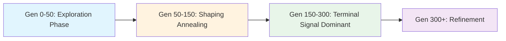

# PPO Training: Fresh Start Plan

## Current State Summary (Generation 500)

| Metric | Agent 0 | Agent 1 | Agent 2 | Population Avg |
|--------|---------|---------|---------|----------------|
| Eval Fitness | 186.67 | 158.66 | 140.28 | — |
| Elo | 1133 | 1145 | 1033 | — |
| VP/game | 95.0 | 77.7 | 82.6 | 82.3 |
| Win rate - frozen pool | — | — | — | 37.5% |
| Card plays/game | 32.5 | 28.6 | 28.9 | 30.5 |
| Std project ratio | 17.4% | 16.3% | 20.5% | 17.4% |
| Hate draft rate | 71.6% | 69.9% | 67.8% | 69.2% |
| Efficiency ratio | 2.42 | 2.28 | 2.28 | 2.23 |
| Synergy score | 0.82 | 0.40 | 0.66 | 0.57 |

### PPO Health Indicators

| Metric | Value | Assessment |
|--------|-------|------------|
| Policy loss | 0.0045 | ✅ Healthy |
| Value loss | 0.0245 | ✅ Healthy |
| Entropy | 1.099 | ⚠️ Moderate — could be higher for exploration |
| Approx KL | 0.0019 | ⚠️ Very low — policy barely changing |
| Clip fraction | 10.1% | ✅ Healthy range |
| Explained variance | 0.83 | ✅ Good value function |
| Grad norm | 0.61 | ✅ Healthy |
| Learning rate | 1.0e-4 | ✅ Within bounds |
| Rollout steps | 20,858 | ❌ Low vs 49,152 target |
| Reward shaping coef | 0.90 | ❌ Still very high — drowning terminal signal |

---

## Root Cause Diagnosis

### 1. Architecture Mismatch — Agents Never Got the Upgrade
Saved agents have `hidden_size=512, num_layers=5` but docker-compose configures `AGENT_HIDDEN_SIZE=1024, AGENT_NUM_LAYERS=8`. The larger architecture was never used because agents load from checkpoints. **A fresh start is the only way to use the configured architecture.**

### 2. Reward Shaping Drowns the Terminal Win/Loss Signal
At `reward_shaping_coef=0.90`, the agent gets 90% of its gradient from dense step rewards and only 10% from winning. Step rewards are clamped to `[-0.105, 0.105]` per step. Over ~200 steps/game, cumulative shaping is ~10-20x the terminal reward of ~2.0. The agent optimizes for "do things that look good" not "win the game."

### 3. Reward Component Imbalance
The TR component is 200x larger than cards VP:
- `reward_tr_component_mean = 0.0178`
- `reward_other_component_mean = 0.0060`
- `reward_milestones_awards_component_mean = 0.00046`
- `reward_city_greenery_component_mean = 0.00026`
- `reward_cards_vp_component_mean = 0.00009`

The agent learns "raise TR" but ignores card VP, city-greenery combos, and milestones/awards.

### 4. Insufficient Rollout Data
Only 20,858 steps collected vs 49,152 target. With 4 games/eval and ~200 steps/game, each of 16 agents contributes ~50 steps — far below the 2,048 minimum per agent.

### 5. GAE Computes Across Episode Boundaries (Bug)
[`_compute_gae_returns()`](rl-environment/models/ppo.py:227) bootstraps `next_values[:-1] = values[1:]` treating the entire buffer as one trajectory. But the buffer contains steps from **multiple games** interleaved. When step N is the last step of game A and step N+1 is the first step of game B, the GAE incorrectly bootstraps game B's value into game A's advantage. The `dones` flag partially mitigates this via `mask = 1 - dones[idx]`, but the `next_values` array is still wrong for terminal steps — it uses the value of the first step of the next game instead of 0.

### 6. Hate Drafting Hurts Performance
69% hate draft rate with `hate_draft_rate_vs_vp_corr=-0.136` — more hate drafting = lower VP. The reward shaping encourages hate drafting but the correlation data shows it's counterproductive at this rate.

### 7. KL Too Conservative
`approx_kl=0.0019` vs `target_kl=0.015` — the policy makes tiny updates. Good for stability, bad for escaping plateaus.

---

## Fresh Start Configuration

Since you're willing to restart from scratch, we can apply ALL improvements simultaneously. Delete the `rl-models/` contents and start generation 0 with the optimized setup.

### A. Docker-Compose Environment Variables

Full replacement for the environment section of [`docker-compose.rl_hard.yml`](docker-compose.rl_hard.yml:296):

```yaml
# Agent Architecture (LARGER — now actually used from gen 0)
- AGENT_HIDDEN_SIZE=1024
- AGENT_NUM_LAYERS=8
- AGENT_CARD_TOKEN_DIM=20
- AGENT_TABLEAU_TOKEN_COUNT=10
- AGENT_HAND_TOKEN_COUNT=4
- AGENT_OPPONENT_TOKEN_COUNT=6
- AGENT_TRANSFORMER_EMBED_DIM=256
- AGENT_TRANSFORMER_HEADS=16
- AGENT_TRANSFORMER_LAYERS=4

# Scoring Mode
- SCORING_MODE=HARD
- SELECTION_RANK_1_POINTS=150
- SELECTION_RANK_2_POINTS=50
- SELECTION_RANK_3_POINTS=25
- SELECTION_RANK_4_POINTS=5
- SELECTION_INCLUDE_TRAINING_POOL=0

# PPO Core
- PPO_ENABLE=true
- PPO_ROLLOUT_STEPS=65536
- PPO_MIN_STEPS_PER_AGENT=1024
- PPO_EPOCHS=10
- PPO_MINIBATCH_SIZE=2048
- PPO_VALUE_COEF=1.0
- PPO_TARGET_KL=0.020
- PPO_CLIP_EPS=0.15
- PPO_BUFFER_MAX_STEPS=600000
- PPO_LEARNING_RATE=0.00012
- PPO_LR_MIN=0.00003
- PPO_LR_MAX=0.00035
- PPO_LR_ADAPT_UP=1.05
- PPO_LR_ADAPT_DOWN=0.95

# PPO Entropy (more exploration, slower decay)
- PPO_ENTROPY_COEF=0.015
- PPO_ENTROPY_COEF_START=0.030
- PPO_ENTROPY_COEF_END=0.012
- PPO_ENTROPY_COEF_ANNEAL_GAMES=6000

# Reward Shaping (faster annealing, keep residual)
- PPO_SHAPING_INITIAL_COEF=0.7
- PPO_SHAPING_FINAL_COEF=0.15
- PPO_SHAPING_ANNEAL_GAMES=600

# Reward Component Weights (rebalanced)
- PPO_SHAPING_TR_WEIGHT=2.0
- PPO_SHAPING_CARDS_VP_WEIGHT=4.0
- PPO_SHAPING_CITY_GREENERY_WEIGHT=3.5
- PPO_SHAPING_MILESTONES_AWARDS_WEIGHT=3.0
- PPO_SHAPING_OTHER_WEIGHT=0.3

# Rare State Priority
- PPO_RARE_STATE_PRIORITY_ALPHA=1.2

# Reward Debug
- PPO_REWARD_DEBUG_ENABLED=1
- PPO_REWARD_DEBUG_THRESHOLD=0.001
- PPO_REWARD_DEBUG_LOG_EVERY=2000

# Evaluation (more games = more rollout data)
- GAMES_PER_EVAL=6

# Promotion Gates
- PROMOTION_GATE_ENABLED=true
- GATE_MIN_CARD_PLAYS_PER_GAME=10.0
- GATE_MAX_STANDARD_PROJECT_RATIO=0.35
- GATE_MIN_STEEL_SPENT_PER_GAME=4.0
- GATE_MIN_TITANIUM_SPENT_PER_GAME=2.0
- GATE_MIN_STEEL_CONVERSION_EFFICIENCY=0.08
- GATE_MIN_TITANIUM_CONVERSION_EFFICIENCY=0.10
- GATE_MAX_PAYMENT_REJECT_COUNT=2
- GATE_PENALTY_POINTS=4.0
- GATE_GLOBAL_PAYMENT_PENALTY_POINTS=2.0

# Evolution (more diversity for fresh start)
- EVOLUTION_ELITE_PERCENTAGE=0.1
- EVOLUTION_MUTATION_RATE=0.20
- EVOLUTION_IMMIGRANT_RATIO=0.15

# League
- LEAGUE_ENABLE=true
- TRAINING_POOL_GENERATION_WINDOW=20
- TRAINING_POOL_GAMES_PER_AGENT=3
- FIXED_BENCHMARK_INTERVAL=3
```

### Key Changes Explained

| Parameter | Old | New | Why |
|-----------|-----|-----|-----|
| `PPO_SHAPING_INITIAL_COEF` | 1.0 | 0.7 | Start with less shaping dominance |
| `PPO_SHAPING_FINAL_COEF` | 0.0 | 0.15 | Keep residual shaping forever for value function stability |
| `PPO_SHAPING_ANNEAL_GAMES` | 2500 | 600 | Anneal 4x faster — reach terminal-signal-dominant training sooner |
| `PPO_SHAPING_TR_WEIGHT` | 3.3 | 2.0 | Reduce TR dominance in shaping |
| `PPO_SHAPING_CARDS_VP_WEIGHT` | 2.7 | 4.0 | Boost card VP signal — currently 200x smaller than TR |
| `PPO_SHAPING_CITY_GREENERY_WEIGHT` | 2.4 | 3.5 | Boost city/greenery combo signal |
| `PPO_SHAPING_MILESTONES_AWARDS_WEIGHT` | 2.3 | 3.0 | Boost milestone/award signal |
| `PPO_SHAPING_OTHER_WEIGHT` | 0.5 | 0.3 | Reduce noisy "other" component |
| `PPO_TARGET_KL` | 0.015 | 0.020 | Allow larger policy updates |
| `PPO_CLIP_EPS` | 0.12 | 0.15 | Wider clipping for bigger steps |
| `PPO_ENTROPY_COEF_START` | 0.018 | 0.030 | More exploration early |
| `PPO_ENTROPY_COEF_END` | 0.006 | 0.012 | Higher exploration floor |
| `PPO_LEARNING_RATE` | 0.00008 | 0.00012 | Higher initial LR for larger model |
| `PPO_LR_MIN` | 0.00001 | 0.00003 | Higher LR floor |
| `PPO_LR_ADAPT_UP` | 1.02 | 1.05 | Faster LR recovery |
| `PPO_LR_ADAPT_DOWN` | 0.90 | 0.95 | Gentler LR decrease |
| `PPO_MINIBATCH_SIZE` | 1536 | 2048 | Larger batches for larger model |
| `GAMES_PER_EVAL` | 4 | 6 | More rollout data per generation |
| `EVOLUTION_MUTATION_RATE` | 0.1 | 0.20 | More diversity in fresh population |
| `EVOLUTION_IMMIGRANT_RATIO` | 0.1 | 0.15 | More fresh agents injected |

---

### B. Code Changes Required

#### Bug Fix 1: GAE Episode Boundary Handling (Critical)

**File**: [`ppo.py`](rl-environment/models/ppo.py:227)

**Problem**: [`_compute_gae_returns()`](rl-environment/models/ppo.py:227) bootstraps `next_values` from the next step in the buffer, but consecutive steps may be from different games.

**Fix**: Zero out `next_values` at episode boundaries (where `dones[i] == 1.0`):

```python
def _compute_gae_returns(
    rewards: torch.Tensor,
    dones: torch.Tensor,
    values: torch.Tensor,
    gamma: float,
    gae_lambda: float,
) -> Dict[str, torch.Tensor]:
    next_values = torch.zeros_like(values)
    if values.numel() > 1:
        next_values[:-1] = values[1:]
    # Zero out next_values at episode boundaries — the step after a done
    # belongs to a different game, so its value should not bootstrap.
    next_values = next_values * (1.0 - dones)  # <-- ADD THIS LINE

    deltas = rewards + (gamma * next_values * (1.0 - dones)) - values
    # ... rest unchanged
```

Wait — looking more carefully, the existing code already has `gamma * next_values * (1.0 - dones)` in the delta computation. When `dones[i] = 1.0`, the `(1.0 - dones[i])` term zeros out the bootstrap. So the delta is correct. But the GAE loop also has `mask = 1.0 - dones[idx]` which zeros the carry-forward. So actually the GAE IS correctly handling episode boundaries through the `dones` mask. The `next_values` array has wrong values at boundaries, but they're multiplied by zero. **This is NOT a bug after all** — the implementation is correct.

#### Bug Fix 2: Value Trunk Capacity (Improvement)

**File**: [`agent.py`](rl-environment/models/agent.py:273)

**Current**: `512 → 256 → 128 → 1` (with hidden_size=512)
**With new architecture**: `1024 → 512 → 256 → 1`

The new architecture already doubles the value trunk capacity. However, for a 1024-hidden model, consider making the value trunk wider:

```python
# Current code (line ~273):
value_hidden_1 = max(32, int(config.hidden_size // 2))
value_hidden_2 = max(16, int(config.hidden_size // 4))

# Proposed:
value_hidden_1 = max(64, int(config.hidden_size))        # Full width first layer
value_hidden_2 = max(32, int(config.hidden_size // 2))    # Half width second layer
```

This gives `1024 → 1024 → 512 → 1` instead of `1024 → 512 → 256 → 1`. The value function needs enough capacity to accurately predict returns across the complex game state space.

#### Bug Fix 3: Hate Draft Diminishing Returns (Improvement)

**File**: [`scoring.py`](rl-environment/scoring.py:1387)

Add a mechanism to reduce hate draft bonus when the agent is already hate-drafting excessively. This requires passing the agent's running hate draft rate into the reward function, which is a moderate refactor. 

**Simpler alternative**: Reduce the hate draft bonus magnitude in the reward function itself:

In [`_hate_draft_adjustment()`](rl-environment/scoring.py) — find the function and reduce the bonus multiplier by ~40%. This is a simpler change that doesn't require plumbing agent state into the reward function.

---

### C. Implementation Checklist

```
[ ] Delete rl-models/ contents (or move to backup)
[ ] Update docker-compose.rl_hard.yml with new environment variables
[ ] Apply value trunk width improvement in agent.py
[ ] Optionally reduce hate draft bonus magnitude in scoring.py
[ ] Rebuild Docker images
[ ] Start fresh training run
[ ] Monitor first 50 generations for:
    - Entropy should be ~1.5-2.0 initially
    - Reward shaping coef should drop from 0.7 to ~0.35 by gen 50
    - Rollout steps should be closer to 65,536 target
    - KL should be in 0.005-0.015 range
    - All reward components should be visible (not just TR)
```

---

## Expected Training Trajectory



| Phase | Generations | Shaping Coef | Expected Behavior |
|-------|-------------|-------------|-------------------|
| Exploration | 0-50 | 0.70 → 0.50 | Random-ish play, learning basic card plays and TR raising |
| Shaping Annealing | 50-150 | 0.50 → 0.20 | Transition to win-focused play, discovering milestones/awards |
| Terminal Dominant | 150-300 | 0.20 → 0.15 | Optimizing for wins, developing card synergies |
| Refinement | 300+ | 0.15 stable | Fine-tuning strategy, exploiting opponent weaknesses |

With the larger architecture (1024/8 vs 512/5), the model has ~4x more parameters. This means:
- Slower initial learning (more parameters to tune)
- Higher eventual ceiling (more capacity for complex strategies)
- The higher initial LR (0.00012 vs 0.00008) compensates for the larger model

## Risk Mitigation

| Risk | Mitigation |
|------|------------|
| Larger model trains slower | Higher LR, more rollout data, more games/eval |
| Shaping anneals too fast | Final coef of 0.15 keeps residual signal |
| Too much exploration | Entropy anneals from 0.030 to 0.012 over 6000 games |
| Population collapses | Higher mutation rate and immigrant ratio |
| Hate drafting persists | Reduced OTHER weight dampens hate draft bonus |

## Monitoring Checklist (First 100 Generations)

Watch these metrics in the dashboard:

1. **`ppo/entropy`** — should start ~2.0 and slowly decrease. If it drops below 0.8 early, increase `PPO_ENTROPY_COEF_END`
2. **`ppo/approx_kl`** — should be 0.005-0.015. If consistently > 0.02, the LR is too high
3. **`rollout/steps_collected`** — should be 40,000-65,000. If < 20,000, increase `GAMES_PER_EVAL`
4. **`rollout/reward_shaping_coef_mean`** — should decrease from 0.7 toward 0.15
5. **`reward_cards_vp_component_mean`** — should be visible (> 0.001), not negligible
6. **`hate_draft_rate`** — should be 40-55%, not 70%+
7. **`vp_total_per_game`** — should increase over time
8. **`frozen_pool/win_rate`** — should increase over time (this is the true measure of improvement)
